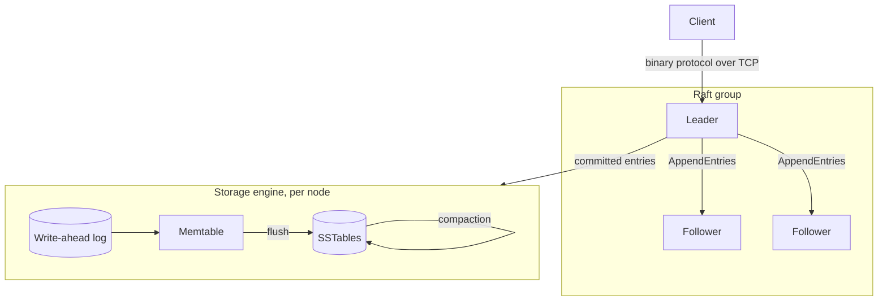

# Keel

[](https://github.com/Nuu-maan/keel/actions/workflows/ci.yml)

Keel is a replicated, strongly consistent key-value store written from scratch in Go. Every layer is built in this repository: the storage engine, the wire protocol and the consensus protocol. No embedded database, no Raft library.

The goal is correctness under failure first, then performance. Every durability or consistency claim below comes with a test that tries to break it.

## Status

| Layer | State |
|---|---|
| Write-ahead log with crash recovery | Done |
| Memtable with tombstones | Done |
| SSTables, memtable flush, WAL rotation | Done |
| Background flush | Planned ([#7](https://github.com/Nuu-maan/keel/issues/7)) |
| Bloom filters | Planned ([#8](https://github.com/Nuu-maan/keel/issues/8)) |
| Compaction | Planned ([#9](https://github.com/Nuu-maan/keel/issues/9)) |
| TCP wire protocol | Planned |
| Raft replication | Planned |
| Chaos testing with linearizability checking | Planned |
| Metrics and benchmarks | Planned |

## Architecture

The target design. Only the storage layer exists today.



## Guarantees

**Durability.** A write is acknowledged only after its WAL record has been written and `fsync`ed. An acknowledged write survives a process crash at any point.

**Fail-stop on I/O errors.** If a write or `fsync` fails, the WAL refuses every later append. After a failed `fsync` the kernel may already have dropped the dirty pages, and retrying can report success while the data is gone (see [fsyncgate](https://wiki.postgresql.org/wiki/Fsync_Errors)). Stopping is the only safe response.

**Corruption is detected, not ignored.** Each WAL record has two CRC32C checksums, one for the header and one for the payload. The header checksum means a damaged length field is caught before the length is used.

A crash leaves at most a prefix of the last record, possibly followed by zeros where the filesystem extended the file. Recovery tells that apart from real damage:

| What replay finds | Action |
|---|---|
| Fewer than 12 bytes left, or a valid header whose payload runs past the end of the file | Torn write; truncate it |
| Bad header or payload checksum, and every byte after it is zero | Torn write; truncate it |
| Bad header or payload checksum, and non-zero data after it | Corruption; refuse to open with `ErrCorrupt` |

Truncating at real corruption would silently drop the acknowledged writes that follow it, so the store refuses to open instead.

SSTables are checked the same way. The footer, the index and every data block carry a CRC32C checksum, and a mismatch fails the read with `ErrCorrupt` instead of returning bad data.

**Crash-safe flush.** When the memtable reaches its size limit (4 MiB by default), it is written to an SSTable and the WAL is rotated:

1. Sort the memtable and write SSTable `N` to `N.sst.tmp`, then `fsync` it.
2. Rename it to `N.sst` and `fsync` the directory.
3. Open a new WAL numbered `N+1`, and delete the old one.

Data files share one increasing sequence of numbers, so no manifest is needed for recovery:

| Found on open | Meaning | Action |
|---|---|---|
| `*.tmp` | Flush interrupted before the rename | Delete |
| WAL numbered below the newest SSTable | Already flushed | Delete without replaying. Replaying it would bring back overwritten values |
| WAL numbered above the newest SSTable | Holds unflushed writes | Replay into the memtable |

A flush error of any kind makes the store read-only. Once `N.sst` exists, the old WAL counts as flushed, so appending to it again would lose writes.

**Reads.** `Get` checks the memtable first, then SSTables from newest to oldest, and stops at the first match. A tombstone means the key is deleted, even if an older table still holds a value.

## On-disk format

### WAL record

```
record  : header (12) | payload
header  : payload crc32c (4) | payload length (4) | header crc32c (4)
payload : op (1) | key len (uvarint) | key | value
```

- Integers are little-endian. Checksums use the Castagnoli polynomial. The header checksum covers the first 8 header bytes, and the payload checksum covers the payload.
- `op` is `1` for put and `2` for delete.
- The value takes up the rest of the payload, so it has no length prefix of its own.

### SSTable

```
file   : block* | index | footer
block  : entry* | crc32c (4)                               closed at ~4 KiB
entry  : key len (uvarint) | key | op (1) | value len (uvarint) | value
index  : { last key len (uvarint) | last key | offset (uvarint) | length (uvarint) } per block
footer : index offset (8) | index len (4) | index crc32c (4) | magic (8)
```

- Entries are sorted by key and appear at most once per table.
- The index is loaded into memory when the table is opened. A lookup binary-searches it for the first block whose last key is at or above the target, then reads that single block with `pread`.
- The magic number is the ASCII string `KEELSST1`.

## Testing

Tests aim at failure modes, not just happy paths.

- **Crash recovery.** The test re-runs its own binary as a writer subprocess that prints each key once `Put` returns. The parent sends `SIGKILL` after a random number of acknowledgements, reopens the store and checks every acknowledged key. This runs for 20 rounds. The memtable is kept small, so kills also land in the middle of flushes and WAL rotations.
- **Mutation-checked.** Each durability test has been seen to fail against a deliberately broken store. Skipping WAL appends, replaying flushed WALs, deleting the live WAL and ignoring tombstones are each caught. A durability test that can't fail proves nothing.
- **Model-based.** 5000 random puts and deletes on a small memtable, so the run goes through many flushes and several reopens. Afterwards every key is checked against a plain Go map.
- **Recovery rules.** A test plants a stale WAL under a newer SSTable, plus a half-written `.tmp` file, and checks that opening the store deletes both and doesn't replay the stale values.
- **Torn writes and corruption.** For the WAL: partial headers, partial payloads, zero-filled tails and a damaged last record are recovered. A damaged checksum, length or payload in the middle of the file is rejected. For SSTables: damaged blocks, index, footer and magic number are all detected.
- **Race detector.** CI runs the whole suite with `-race`.

`SIGKILL` leaves the kernel page cache intact, so it doesn't simulate power loss. Power-loss testing is tracked in [#2](https://github.com/Nuu-maan/keel/issues/2).

```
go test -race ./...
```

## Layout

```
storage/
  wal.go       write-ahead log: record format, append, replay, torn-tail recovery
  sstable.go   SSTable writer and reader: blocks, index, footer
  store.go     memtable, flush, WAL rotation, recovery, read path
```

## Roadmap

1. **Storage engine.** Bloom filters ([#8](https://github.com/Nuu-maan/keel/issues/8)), compaction ([#9](https://github.com/Nuu-maan/keel/issues/9)), background flush ([#7](https://github.com/Nuu-maan/keel/issues/7)), group commit ([#1](https://github.com/Nuu-maan/keel/issues/1)).
2. **Wire protocol.** Length-prefixed binary framing over TCP, with deadlines and backpressure.
3. **Raft.** Leader election, log replication, snapshots, and linearizable reads through ReadIndex.
4. **Chaos testing.** Process kills, `SIGSTOP`, network partitions with `iptables`, latency with `tc netem`. Recorded histories checked for linearizability with [Porcupine](https://github.com/anishathalye/porcupine).
5. **Observability.** Prometheus metrics for latency histograms, `fsync` time, replication lag and elections.
6. **Benchmarks.** Throughput and p50/p99/p99.9 latency under uniform and Zipfian workloads, compared with etcd.
