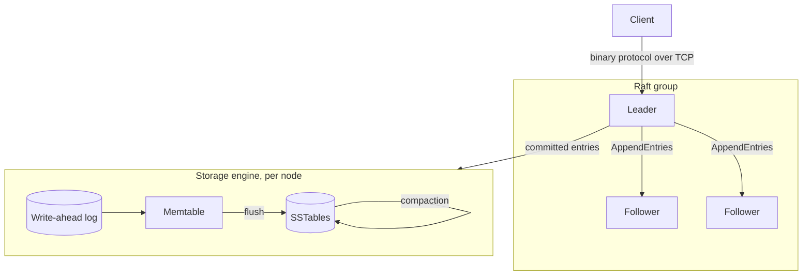

# Keel

[](https://github.com/Nuu-maan/keel/actions/workflows/ci.yml)

Keel is a replicated, strongly consistent key-value store written from scratch in Go. Every layer is built in this repository: the storage engine, the wire protocol and the consensus protocol. No embedded database, no Raft library.

The goal is correctness under failure first, then performance. Every durability or consistency claim below comes with a test that tries to break it.

## Status

| Layer | State |
|---|---|
| Write-ahead log with crash recovery | Done |
| In-memory table | Done |
| SSTables, flush, WAL rotation | In progress ([#4](https://github.com/Nuu-maan/keel/issues/4)) |
| Bloom filters, compaction | Planned |
| TCP wire protocol | Planned |
| Raft replication | Planned |
| Chaos testing with linearizability checking | Planned |
| Metrics and benchmarks | Planned |

## Architecture

The target design. Only the storage layer exists today.



## Guarantees

**Durability.** A write is acknowledged only after its WAL record has been written and `fsync`ed. An acknowledged write survives a process crash at any point.

**Fail-stop on I/O errors.** If a write or `fsync` fails, the WAL refuses every later append. After a failed `fsync` the kernel may already have dropped the dirty pages, and retrying can report success while the data is gone (see [fsyncgate](https://wiki.postgresql.org/wiki/Fsync_Errors)). Stopping is the only safe response.

**Corruption is detected, not ignored.** Every record carries a CRC32C checksum. On recovery:

| What replay finds | Action |
|---|---|
| Partial header or payload at end of file | Torn write from a crash; truncate it |
| Bad checksum on the last record | Torn write from a crash; truncate it |
| Bad checksum with more data after it | Real corruption; refuse to open with `ErrCorrupt` |

Known gap: a corrupted length field in the middle of the file is currently treated as a torn tail ([#3](https://github.com/Nuu-maan/keel/issues/3)).

## On-disk format

### WAL record

```
+------------+------------+--------+------------------+---------+-----------+
| crc32c (4) | length (4) | op (1) | key len (uvarint) |   key   |   value   |
+------------+------------+--------+------------------+---------+-----------+
             |<------------------------ length bytes ------------------------>|
```

- Integers are little-endian. The checksum uses the Castagnoli polynomial and covers everything after the header.
- `op` is `1` for put and `2` for delete.
- The value takes up the rest of the payload, so it has no length prefix of its own.

## Testing

Tests aim at failure modes, not just happy paths.

- **Crash recovery.** The test re-runs its own binary as a writer subprocess that prints each key once `Put` returns. The parent sends `SIGKILL` after a random number of acknowledgements, reopens the store and checks every acknowledged key. This runs for 20 rounds.
- **Mutation-checked.** Making the store skip some WAL appends makes the crash test fail. A durability test that can't fail proves nothing.
- **Torn writes and corruption.** Partial headers, partial payloads and bad checksums at the tail are recovered. Corruption in the middle of the file is rejected.
- **Race detector.** CI runs the whole suite with `-race`.

`SIGKILL` leaves the kernel page cache intact, so it doesn't simulate power loss. Power-loss testing is tracked in [#2](https://github.com/Nuu-maan/keel/issues/2).

```
go test -race ./...
```

## Layout

```
storage/    write-ahead log and storage engine
```

## Roadmap

1. **Storage engine.** SSTables with a block index, memtable flush, WAL rotation, bloom filters, leveled compaction, group commit ([#1](https://github.com/Nuu-maan/keel/issues/1)).
2. **Wire protocol.** Length-prefixed binary framing over TCP, with deadlines and backpressure.
3. **Raft.** Leader election, log replication, snapshots, and linearizable reads through ReadIndex.
4. **Chaos testing.** Process kills, `SIGSTOP`, network partitions with `iptables`, latency with `tc netem`. Recorded histories checked for linearizability with [Porcupine](https://github.com/anishathalye/porcupine).
5. **Observability.** Prometheus metrics for latency histograms, `fsync` time, replication lag and elections.
6. **Benchmarks.** Throughput and p50/p99/p99.9 latency under uniform and Zipfian workloads, compared with etcd.
