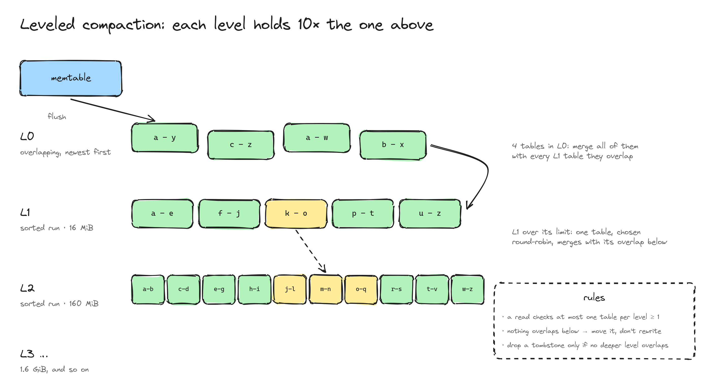
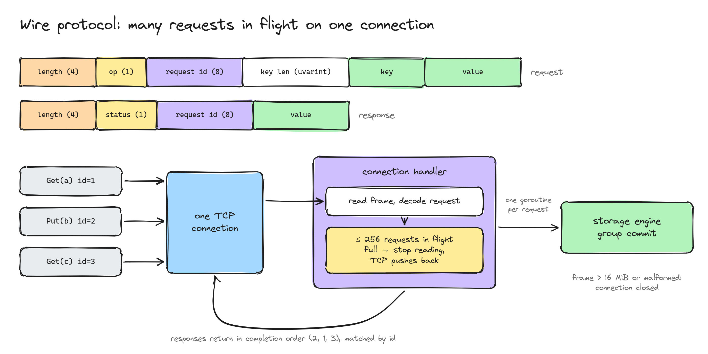

# Keel

[](https://github.com/Nuu-maan/keel/actions/workflows/ci.yml)

Keel is a strongly consistent, replicated key-value store written from scratch in Go. It includes an LSM storage engine, a TCP client/server, and fixed-membership Raft replication. No embedded database or Raft library.

The goal is correctness under failure first, then performance. Every durability or consistency claim below comes with a test that tries to break it.

## Status

| Layer | State |
|---|---|
| Write-ahead log with crash recovery | Done |
| Group commit | Done |
| Memtable with tombstones | Done |
| SSTables, memtable flush, WAL rotation | Done |
| Bloom filters | Done |
| Manifest-based recovery | Done |
| Leveled compaction with a streaming merge | Done |
| Background flush behind an immutable memtable | Done |
| Background compaction | Done |
| TCP wire protocol, server, client, CLI | Done |
| Raft elections, log replication, quorum writes and reads | Done |
| Snapshot transfer and catch-up | Done |
| Membership changes and segmented Raft log | Planned |
| Chaos testing with linearizability checking | Planned |
| Metrics and benchmarks | Planned |

## Quick start

```
go build -o keeld ./cmd/keeld
go build -o keelctl ./cmd/keelctl

./keeld -addr 127.0.0.1:7070 -dir data &
./keelctl put greeting "hello keel"
./keelctl get greeting
./keelctl del greeting
```

The default command starts one standalone node. For a three-node cluster on one machine:

```sh
PEERS='1=127.0.0.1:7081@127.0.0.1:7071,2=127.0.0.1:7082@127.0.0.1:7072,3=127.0.0.1:7083@127.0.0.1:7073'
./keeld -id 1 -addr 127.0.0.1:7071 -peer-addr 127.0.0.1:7081 -peers "$PEERS" -dir data-1 &
./keeld -id 2 -addr 127.0.0.1:7072 -peer-addr 127.0.0.1:7082 -peers "$PEERS" -dir data-2 &
./keeld -id 3 -addr 127.0.0.1:7073 -peer-addr 127.0.0.1:7083 -peers "$PEERS" -dir data-3 &
./keelctl -addr 127.0.0.1:7072 put greeting "hello cluster"
./keelctl -addr 127.0.0.1:7073 get greeting
```

Wait a couple of seconds for election before the first request. Each node needs its own directory; keep its ID and peer list the same across restarts. Followers forward client calls to the known leader. Peer addresses outside loopback require mutual TLS via `-peer-cert`, `-peer-key`, and `-peer-ca` on every node. Client connections use the existing plain TCP protocol, so expose that port only on a trusted network or behind a TLS proxy ([#27](https://github.com/Nuu-maan/keel/issues/27)). `keeld` shuts down cleanly on `SIGINT` or `SIGTERM`.


## Architecture

The three-node cluster follows this design. Cluster membership is currently fixed at startup ([#25](https://github.com/Nuu-maan/keel/issues/25)).


## Guarantees

**Durability.** In standalone mode, a write is acknowledged after its WAL record is `fsync`ed. In cluster mode, the leader acknowledges only after a majority has durably stored the Raft entry and the leader has applied it. An acknowledged write survives the loss of a minority of nodes.

**Group commit.** One writer goroutine owns the WAL. Each `Put` or `Delete` sends its record to that goroutine and waits. The writer takes every request already queued, appends the whole batch with one `write` and one `fsync`, applies it to the memtable, and then acknowledges each caller. Durability is unchanged, because nobody is acknowledged before the `fsync` that covers their record. The store lock is held only while applying a batch or swapping in new tables, never across disk I/O, so reads don't wait on the disk.


**Fail-stop on I/O errors.** If a write or `fsync` fails, the WAL refuses every later append. After a failed `fsync` the kernel may already have dropped the dirty pages, and retrying can report success while the data is gone (see [fsyncgate](https://wiki.postgresql.org/wiki/Fsync_Errors)). Stopping is the only safe response.

**Corruption is detected, not ignored.** Each WAL record has two CRC32C checksums, one for the header and one for the payload. The header checksum means a damaged length field is caught before the length is used.

A crash leaves at most a prefix of the last record, possibly followed by zeros where the filesystem extended the file. Recovery tells that apart from real damage:

| What replay finds | Action |
|---|---|
| Fewer than 12 bytes left, or a valid header whose payload runs past the end of the file | Torn write; truncate it |
| Bad header or payload checksum, and every byte after it is zero | Torn write; truncate it |
| Bad header or payload checksum, and non-zero data after it | Corruption; refuse to open with `ErrCorrupt` |

Truncating at real corruption would silently drop the acknowledged writes that follow it, so the store refuses to open instead.

SSTables are checked the same way. The footer, the index and every data block carry a CRC32C checksum, and a mismatch fails the read with `ErrCorrupt` instead of returning bad data.

**The manifest is the commit point.** A `MANIFEST` file lists the live SSTables in each level and the first WAL to replay. Flush and compaction never change live files in place. Each one writes its new files, then replaces the manifest atomically (write to `MANIFEST.tmp`, `fsync`, rename, `fsync` the directory). Until that rename lands, the old state is still complete, and afterwards the new one is.

**Flush.** When the memtable reaches its size limit (4 MiB by default), the writer:

1. Opens a new WAL, `N`, for the writes that follow.
2. Keeps the full memtable as an immutable table, still visible to reads, and starts an empty one.
3. Hands the immutable memtable to a background job.

The job writes it to SSTable `M` with the same atomic write, commits a manifest that lists `M` and names `N` as the first WAL to replay, deletes the old WAL, and wakes the compactor. Writes continue into the new memtable meanwhile. At most one immutable memtable exists, so if the new one fills before the job finishes, writes wait for it.

**Leveled compaction.** Tables live in levels:
- **L0** holds flushed tables, newest first. Their key ranges may overlap.
- **L1 and deeper** are sorted runs of tables whose ranges don't overlap. L1 may hold 16 MiB, and each deeper level ten times more than the one above.

A version in a shallower level is always newer than one in a deeper level.

- **L0 into L1.** When L0 reaches 4 tables, all of them merge with every L1 table they overlap.
- **Deeper levels.** When a deeper level exceeds its limit, one of its tables merges with the tables it overlaps in the next level. Tables are picked round-robin, so the work spreads across the key space.
- **Streaming merge.** Inputs are read block by block through a k-way merge (`container/heap`), and output is cut into tables of about 2 MiB, so memory stays bounded regardless of database size.
- **Trivial move.** A table that overlaps nothing in the next level moves down by a manifest update alone, with no rewrite.
- **Tombstones.** A tombstone is dropped only when no level below the output overlaps the merged key range. If one did, dropping the tombstone would let an older value in that level come back.
- **Background.** One compactor goroutine runs compactions while writes and flushes continue. Each commit applies its change to the levels as they are at that moment, so tables flushed into L0 during a merge stay above its output.
- **Scheduling.** The compactor picks the level furthest past its limit: L0 by table count against its trigger, deeper levels by size against theirs. Always preferring L0 would starve L1 under steady writes, and every L0 compaction would then rewrite all of it.
- **Write stop.** While L0 holds 12 tables, three times its trigger, writes wait for compaction. This bounds read amplification and the size of the next L0 compaction.

As with flush, the new manifest is committed before any input is deleted.



**Recovery** follows the manifest and deletes whatever it doesn't reference, then wakes the compactor in case the crash left a compaction due:


| Found on open | Meaning | Action |
|---|---|---|
| `*.tmp` | Interrupted atomic write | Delete |
| SSTable not in the manifest | Output of an interrupted flush or compaction, or a leftover compaction input | Delete |
| WAL below the manifest's log number | Already flushed | Delete without replaying. Replaying it would bring back overwritten values |
| WAL at or above the log number | Holds unflushed writes | Replay into the memtable |
| SSTables but no manifest | The manifest was lost. A new store writes an empty one before anything else | Refuse to open |

Any error during flush or compaction makes the store read-only. After a partially applied manifest update, the store can't tell which WAL recovery will replay, so accepting more writes could lose them.

**Reads.** `Get` checks the memtable first, then the immutable memtable while it is being flushed, then every L0 table from newest to oldest, then at most one table in each deeper level, found by binary search on the tables' key ranges. It stops at the first match. A tombstone means the key is deleted, even if an older table still holds a value. Each SSTable's bloom filter is checked before its index, so for a key the table doesn't contain, about 99% of lookups skip the disk read entirely.


## Network protocol



```
frame    : length (4, big-endian) | payload                 payload ≤ 16 MiB
request  : op (1) | request id (8) | key len (uvarint) | key | value
response : status (1) | request id (8) | value
op       : 1 get · 2 put · 3 delete
status   : 0 ok · 1 not found · 2 error (value holds the message)
```

- **Pipelining.** A client can have many requests in flight on one connection. The server runs each in its own goroutine, so requests from a single connection share group-commit batches. Responses go back in completion order, and the client matches them to callers by request ID.
- **Backpressure.** Each connection allows at most 256 requests in flight. When that's reached, the server stops reading from the socket, TCP flow control fills the client's send buffer, and the client slows down instead of growing an unbounded queue on the server.
- **Hostile input.** A length prefix over 16 MiB is rejected before anything is allocated. A malformed request or unknown op closes the connection, because with a broken frame there's no trustworthy request ID to answer.
- **Deadlines.** A connection with no request for 5 minutes is closed. A response that can't be written within 10 seconds closes the connection. The client passes its `context` deadline down to the socket as a write deadline.

## Raft replication

`raft.Node` implements fixed-membership elections, log matching, durable quorum commits, and snapshot installation following [the Raft paper](https://raft.github.io/raft.pdf). Terms, votes, committed index, log entries, and snapshots are stored in one durable record before dependent messages are returned. Each node keeps a separate application store and replays committed commands after restart. A persistence or application error stops protocol participation.

Leaders append a no-op entry in their own term after election. Writes return only after the entry reaches a majority and is applied. For a read, the leader first confirms its term with a majority, then reads its applied state; this also rejects reads by an isolated old leader. A node that falls behind receives missing entries or a snapshot, then replays the remaining suffix. Snapshot installation replaces the follower's application state, including deleted keys. Elections use randomized 1–1.9 second timeouts and 100 ms heartbeat ticks by default. Tune `-raft-tick`, `-election-ticks`, and `-peer-timeout` for your network and disk latency.

The current Raft log is stored as one atomic value and compacted after 128 committed entries when the snapshot fits in 8 MiB. Larger snapshots are deferred so lagging nodes can still catch up through log entries. This keeps conflict rewrites crash-safe but makes each append proportional to the un-compacted log size. Commands are limited to 1 MiB, and peer RPC bodies to 16 MiB. Fixed membership ([#25](https://github.com/Nuu-maan/keel/issues/25)), chunked snapshots and a segmented Raft log ([#24](https://github.com/Nuu-maan/keel/issues/24)) are future work. Cluster writes made without a majority may later commit; an error means the outcome is unknown. A retry is a new operation and can reorder with another write to the same key. Stable client request IDs for deduplication are tracked in [#28](https://github.com/Nuu-maan/keel/issues/28).

## On-disk format

### WAL record

```
record  : header (12) | payload
header  : payload crc32c (4) | payload length (4) | header crc32c (4)
payload : op (1) | key len (uvarint) | key | value
```

- Integers are little-endian. Checksums use the Castagnoli polynomial. The header checksum covers the first 8 header bytes, and the payload checksum covers the payload.
- `op` is `1` for put and `2` for delete.
- The value takes up the rest of the payload, so it has no length prefix of its own.

### SSTable


```
file    : block* | filter | index | footer
block   : entry* | crc32c (4)                               closed at ~4 KiB
entry   : key len (uvarint) | key | op (1) | value len (uvarint) | value
filter  : bloom bits | probe count (1)
index   : { last key len (uvarint) | last key | offset (uvarint) | length (uvarint) } per block
footer  : filter section | index section | magic (8)
section : offset (8) | length (4) | crc32c (4)
```

- Entries are sorted by key and appear at most once per table.
- The filter and index are loaded into memory when the table is opened. A lookup checks the filter, then binary-searches the index for the first block whose last key is at or above the target, and reads that single block with `pread`.
- The bloom filter uses 10 bits per key and 7 probes, with double hashing over 64-bit FNV-1a. Its measured false-positive rate is 0.92%, against a theoretical 0.82%. Tombstones go into the filter too, because a delete has to be found in order to hide older values.
- The magic number is the ASCII string `KEELSST2`.

## Performance

`BenchmarkPut` measures concurrent 100-byte puts, before and after group commit. The machine has 8 cores and btrfs on a device-mapper volume, and the data directory is on that disk, not tmpfs. `fsync` latency on this disk varies between about 1 and 3 ms from run to run, so each row gives the range over three interleaved runs.

| Concurrent writers | Before, per write | After, per write | Speedup |
|---|---|---|---|
| 1 | 1.1–3.1 ms | 1.1–3.3 ms | none (bound by `fsync`) |
| 8 | 1.1–3.2 ms | 0.61–0.80 ms | ~2–4× |
| 128 | 1.1–3.6 ms | 18–38 µs | ~60–100× |
| 1024 | 1.1–3.2 ms | 10–11 µs | ~100–300× |

Before, throughput was capped at one write per `fsync`, a few hundred to about 900 writes per second, however many clients were writing. Afterwards it grows with concurrency, reaching roughly 95k writes per second with 1024 writers.

```
KEEL_BENCH_DIR=/path/on/real/disk go test -run '^$' -bench Put ./storage/
```

### Put latency

`BenchmarkPutLatency` records the latency of each of 1M concurrent 100-byte puts from 128 goroutines with default options, so the run goes through about 25 flushes and their compactions. Each row gives the range over four interleaved runs on the same disk.

| | p50 | p99 | p99.9 | Max |
|---|---|---|---|---|
| Inline flush | 1.9–2.2 ms | 16–18 ms | 86–221 ms | 0.64–0.97 s |
| Background flush | 2.1–2.4 ms | 14–41 ms | 33–68 ms | 0.55–2.0 s |

Moving the flush off the write path cuts p99.9 by 3–6×. The median and p99 are dominated by `fsync` time, which a flush doesn't change. The maximum is still high: the background job compacts after it flushes, and if the next memtable fills before that compaction finishes, writes wait for it ([#33](https://github.com/Nuu-maan/keel/issues/33)).

```
go test -run '^$' -bench PutLatency -benchtime 1000000x ./storage/
```

### Write amplification

`BenchmarkWriteAmplification` writes 100-byte values under random keys, drawn from a key space twice the number of writes. It then divides the bytes written to SSTables by the bytes the client wrote. The memtable is 256 KiB, with L1 at 1 MiB and 256 KiB output tables, scaled down from the defaults in the same proportion so the levels fill up quickly.

| Data written | Full compaction | Leveled compaction | Time, full → leveled |
|---|---|---|---|
| 16 MiB | 10.2× | 6.1× | 5.1 s → 2.1 s |
| 64 MiB | 38.8× | 10.8× | 72 s → 13 s |
| 128 MiB | 76.0× | 13.2× | 288 s → 35 s |

Full compaction rewrites every live byte each time it runs, so its write amplification grows in proportion to the database. Leveled compaction rewrites a byte about once per level it passes through, so its amplification grows with the number of levels, which is logarithmic in the database size.

```
go test -run '^$' -bench WriteAmplification -benchtime 1x ./storage/
```

## Testing

Tests aim at failure modes, not just happy paths.

- **Crash recovery.** The test re-runs its own binary as a writer subprocess that prints each key once `Put` returns. The parent sends `SIGKILL` after a random number of acknowledgements, reopens the store and checks every acknowledged key. This runs for 20 rounds. The memtable and compaction trigger are kept small, so kills also land in the middle of flushes, manifest commits and compactions.
- **Mutation-checked.** Each durability test has been seen to fail against a deliberately broken store. Each of these mutations is caught: skipping WAL appends, replaying flushed WALs, deleting the live WAL, ignoring tombstones, keeping tombstones through compaction, dropping tombstones while a deeper level holds the key, reads skipping deeper levels or a memtable that is being flushed, and compaction ignoring overlapping tables below. A durability test that can't fail proves nothing.
- **Model-based.** 5000 random puts and deletes on a small memtable, so the run goes through many flushes and several reopens. Afterwards every key is checked against a plain Go map.
- **Recovery rules.** A test plants a flushed WAL, an orphaned SSTable and a half-written `.tmp` file next to a manifest. Opening the store must delete all three and serve neither the stale nor the orphaned values. A table left by a crash before the first manifest commit is deleted like any other orphan. A store with SSTables but no manifest refuses to open.
- **Compaction.** Five rounds of overwrites and deletes over 100 keys are compacted from L0 into L1. L1 must hold exactly the 50 live keys at their latest values, with no tombstones, because nothing lies below it. The result must survive a reopen.
- **Tombstone safety.** A key is pushed down to L2 by a trivial move, which the test also checks: the table is the same file, not a rewrite. The key is then deleted and the delete compacted into L1. The tombstone must survive, because L2 still holds the old value, and the key must stay deleted after a reopen.
- **Compaction scheduling.** Under steady writes, L0 must never hold more than three times its trigger, and L1 must never grow past ten times its limit. Each check fails when the write stop or the level scoring is removed. A store reopened with a full L0 must compact it instead of stalling the first write.
- **Level invariants.** After the model and compaction tests, a check confirms three things: L0 is below its trigger, every deeper level is sorted with no overlapping ranges, and the SSTable files on disk match the manifest exactly. The model test uses small level sizes, so it goes through L2 and deeper.
- **Torn writes and corruption.** For the WAL: partial headers, partial payloads, zero-filled tails and a damaged last record are recovered. A damaged checksum, length or payload in the middle of the file is rejected. For SSTables: damaged blocks, filter, index, footer and magic number are all detected.
- **Filter effectiveness.** A test fills an SSTable's data blocks with garbage but leaves the filter and index intact. Lookups for absent keys still succeed, because the filter stops them before any block is read. With the filter disabled, 1999 of 2000 of those lookups read a block.
- **Batching.** A test holds the store lock while 64 writers queue up, then checks that they all reach disk in at most 4 WAL commits. Disabling the batching loop makes it fail with 64 commits.
- **Network, end to end.** The tests run a real server on a loopback socket. They cover put, get and delete, and 500 concurrent calls pipelined over a single connection. They also check that the server closes the connection on an unknown op, an oversized length prefix or an idle timeout, and that clients fail cleanly when the server shuts down.
- **Raft over real sockets.** Three nodes elect a leader, forward client calls, survive leader loss, reject minority writes and reads, install a snapshot, catch up the log suffix, and recover after restart. Peer TLS is tested with and without a client certificate; a separate test kills and restarts a daemon process after acknowledged writes.
- **Race detector.** CI runs the whole suite with `-race`.

`SIGKILL` leaves the kernel page cache intact, so it doesn't simulate power loss. Power-loss testing is tracked in [#2](https://github.com/Nuu-maan/keel/issues/2).

```
go test -race ./...
```

## Layout

```
cmd/
  keeld/       server binary
  keelctl/     command-line client
wire/          frame and message encoding
server/        TCP server: pipelining, backpressure, deadlines, shutdown
client/        Go client: pipelined calls over one connection, context support
raft/          elections, durable log, snapshots, peer transport, quorum reads/writes
storage/
  wal.go       write-ahead log: record format, append, replay, torn-tail recovery
  sstable.go   SSTable writer and reader: blocks, filter, index, footer
  bloom.go     bloom filter
  merge.go     k-way merge iterator; the newest source wins
  manifest.go  live-file manifest, replaced atomically
  store.go     memtable, background flush, leveled compaction, recovery, read path
```

## Roadmap

1. **Storage engine.** Keep background table writes from slowing WAL `fsync` ([#36](https://github.com/Nuu-maan/keel/issues/36)).
2. **Raft.** Fixed-membership replication is operational. Segmented logs and chunked snapshots ([#24](https://github.com/Nuu-maan/keel/issues/24)), then membership changes ([#25](https://github.com/Nuu-maan/keel/issues/25)).
3. **Chaos testing** ([#26](https://github.com/Nuu-maan/keel/issues/26)). Process kills, `SIGSTOP`, network partitions with `iptables`, latency with `tc netem`. Recorded histories checked for linearizability with [Porcupine](https://github.com/anishathalye/porcupine).
4. **Observability.** Prometheus metrics for latency histograms, `fsync` time, replication lag and elections.
5. **Benchmarks.** Throughput and p50/p99/p99.9 latency under uniform and Zipfian workloads, compared with etcd.
