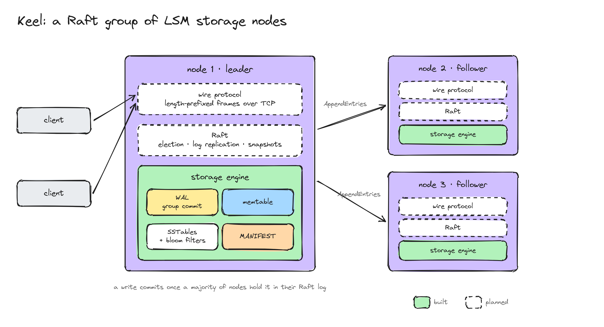
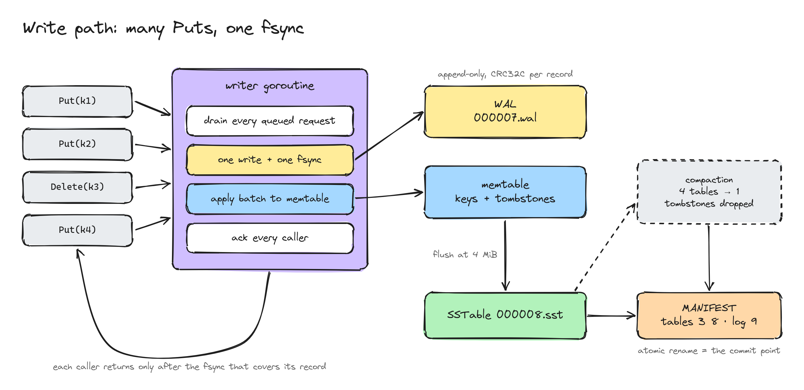
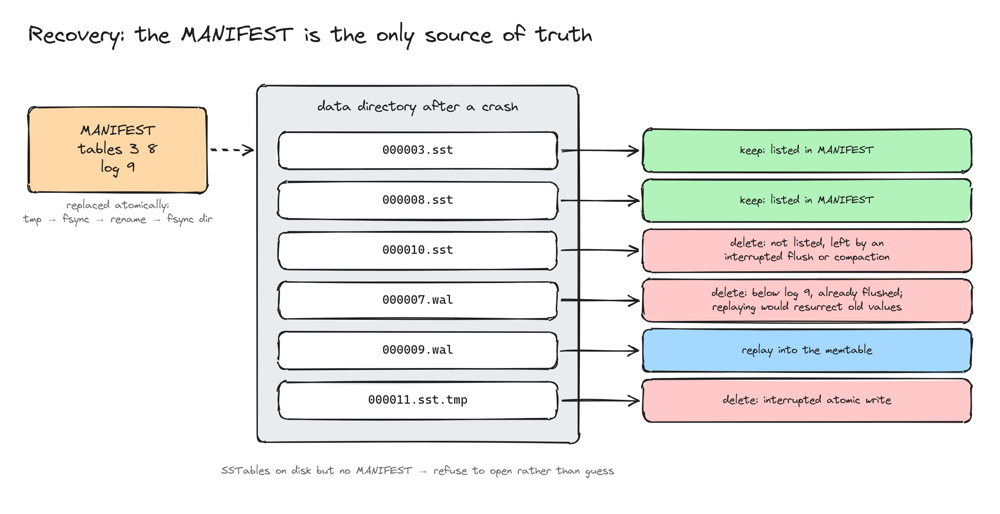
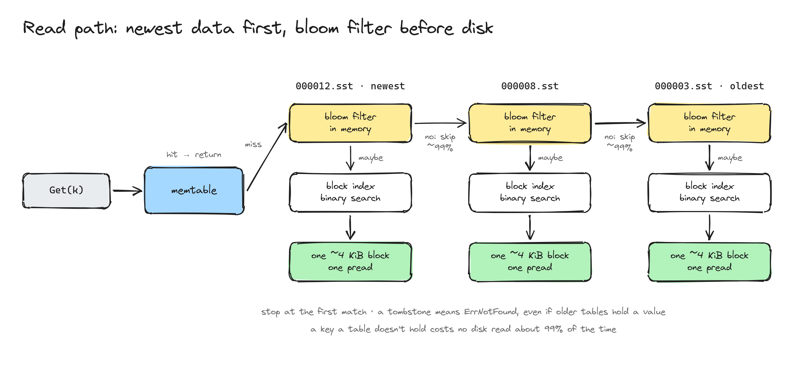
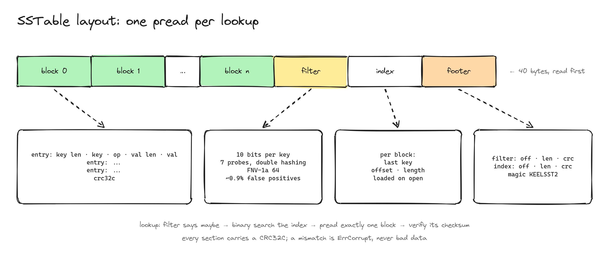

# Keel

[](https://github.com/Nuu-maan/keel/actions/workflows/ci.yml)

Keel is a replicated, strongly consistent key-value store written from scratch in Go. Every layer is built in this repository: the storage engine, the wire protocol and the consensus protocol. No embedded database, no Raft library.

The goal is correctness under failure first, then performance. Every durability or consistency claim below comes with a test that tries to break it.

## Status

| Layer | State |
|---|---|
| Write-ahead log with crash recovery | Done |
| Group commit | Done |
| Memtable with tombstones | Done |
| SSTables, memtable flush, WAL rotation | Done |
| Bloom filters | Done |
| Manifest-based recovery | Done |
| Full compaction | Done |
| Leveled compaction | Planned ([#13](https://github.com/Nuu-maan/keel/issues/13)) |
| Background flush and compaction | Planned ([#7](https://github.com/Nuu-maan/keel/issues/7)) |
| TCP wire protocol | Planned |
| Raft replication | Planned |
| Chaos testing with linearizability checking | Planned |
| Metrics and benchmarks | Planned |

## Architecture

The target design. The storage engine is built; the wire protocol and Raft come next.



## Guarantees

**Durability.** A write is acknowledged only after its WAL record has been written and `fsync`ed. An acknowledged write survives a process crash at any point.

**Group commit.** One writer goroutine owns the WAL. Each `Put` or `Delete` sends its record to that goroutine and waits. The writer takes every request already queued, appends the whole batch with one `write` and one `fsync`, applies it to the memtable, and then acknowledges each caller. Durability is unchanged, because nobody is acknowledged before the `fsync` that covers their record. The store lock is held only while applying a batch or swapping in new tables, never across an `fsync`, so reads don't wait on the disk.



**Fail-stop on I/O errors.** If a write or `fsync` fails, the WAL refuses every later append. After a failed `fsync` the kernel may already have dropped the dirty pages, and retrying can report success while the data is gone (see [fsyncgate](https://wiki.postgresql.org/wiki/Fsync_Errors)). Stopping is the only safe response.

**Corruption is detected, not ignored.** Each WAL record has two CRC32C checksums, one for the header and one for the payload. The header checksum means a damaged length field is caught before the length is used.

A crash leaves at most a prefix of the last record, possibly followed by zeros where the filesystem extended the file. Recovery tells that apart from real damage:

| What replay finds | Action |
|---|---|
| Fewer than 12 bytes left, or a valid header whose payload runs past the end of the file | Torn write; truncate it |
| Bad header or payload checksum, and every byte after it is zero | Torn write; truncate it |
| Bad header or payload checksum, and non-zero data after it | Corruption; refuse to open with `ErrCorrupt` |

Truncating at real corruption would silently drop the acknowledged writes that follow it, so the store refuses to open instead.

SSTables are checked the same way. The footer, the index and every data block carry a CRC32C checksum, and a mismatch fails the read with `ErrCorrupt` instead of returning bad data.

**The manifest is the commit point.** A `MANIFEST` file lists the live SSTables and the first WAL to replay. Flush and compaction never change live files in place. Each one writes its new files, then replaces the manifest atomically (write to `MANIFEST.tmp`, `fsync`, rename, `fsync` the directory). Until that rename lands, the old state is still complete, and afterwards the new one is.

**Flush.** When the memtable reaches its size limit (4 MiB by default):

1. Write the sorted memtable to SSTable `N`, using the same atomic write.
2. Open a new WAL, `N+1`.
3. Commit a manifest that lists `N` and names `N+1` as the first WAL to replay.
4. Delete the old WAL.

**Compaction.** When the table count reaches a trigger (4 by default), every SSTable is merged into one, newest version first. Because the merge includes the oldest table, nothing older is left that could still hold a deleted or overwritten key, so tombstones and stale versions are dropped. The new manifest lists only the output table, and the inputs are then deleted. Full compaction rewrites all live data each time; leveled compaction is tracked in [#13](https://github.com/Nuu-maan/keel/issues/13).

**Recovery** follows the manifest and deletes whatever it doesn't reference:



| Found on open | Meaning | Action |
|---|---|---|
| `*.tmp` | Interrupted atomic write | Delete |
| SSTable not in the manifest | Output of an interrupted flush or compaction, or a leftover compaction input | Delete |
| WAL below the manifest's log number | Already flushed | Delete without replaying. Replaying it would bring back overwritten values |
| WAL at or above the log number | Holds unflushed writes | Replay into the memtable |
| SSTables but no manifest | Unknown state | Refuse to open |

Any error during flush or compaction makes the store read-only. After a partially applied manifest update, the store can't tell which WAL recovery will replay, so accepting more writes could lose them.

**Reads.** `Get` checks the memtable first, then SSTables from newest to oldest, and stops at the first match. A tombstone means the key is deleted, even if an older table still holds a value. Each SSTable's bloom filter is checked before its index, so for a key the table doesn't contain, about 99% of lookups skip the disk read entirely.



## On-disk format

### WAL record

```
record  : header (12) | payload
header  : payload crc32c (4) | payload length (4) | header crc32c (4)
payload : op (1) | key len (uvarint) | key | value
```

- Integers are little-endian. Checksums use the Castagnoli polynomial. The header checksum covers the first 8 header bytes, and the payload checksum covers the payload.
- `op` is `1` for put and `2` for delete.
- The value takes up the rest of the payload, so it has no length prefix of its own.

### SSTable



```
file    : block* | filter | index | footer
block   : entry* | crc32c (4)                               closed at ~4 KiB
entry   : key len (uvarint) | key | op (1) | value len (uvarint) | value
filter  : bloom bits | probe count (1)
index   : { last key len (uvarint) | last key | offset (uvarint) | length (uvarint) } per block
footer  : filter section | index section | magic (8)
section : offset (8) | length (4) | crc32c (4)
```

- Entries are sorted by key and appear at most once per table.
- The filter and index are loaded into memory when the table is opened. A lookup checks the filter, then binary-searches the index for the first block whose last key is at or above the target, and reads that single block with `pread`.
- The bloom filter uses 10 bits per key and 7 probes, with double hashing over 64-bit FNV-1a. Its measured false-positive rate is 0.92%, against a theoretical 0.82%. Tombstones go into the filter too, because a delete has to be found in order to hide older values.
- The magic number is the ASCII string `KEELSST2`.

## Performance

`BenchmarkPut` measures concurrent 100-byte puts, before and after group commit. The machine has 8 cores and btrfs on a device-mapper volume, and the data directory is on that disk, not tmpfs. `fsync` latency on this disk varies between about 1 and 3 ms from run to run, so each row gives the range over three interleaved runs.

| Concurrent writers | Before, per write | After, per write | Speedup |
|---|---|---|---|
| 1 | 1.1–3.1 ms | 1.1–3.3 ms | none (bound by `fsync`) |
| 8 | 1.1–3.2 ms | 0.61–0.80 ms | ~2–4× |
| 128 | 1.1–3.6 ms | 18–38 µs | ~60–100× |
| 1024 | 1.1–3.2 ms | 10–11 µs | ~100–300× |

Before, throughput was capped at one write per `fsync`, a few hundred to about 900 writes per second, however many clients were writing. Afterwards it grows with concurrency, reaching roughly 95k writes per second with 1024 writers.

```
KEEL_BENCH_DIR=/path/on/real/disk go test -run '^$' -bench Put ./storage/
```

## Testing

Tests aim at failure modes, not just happy paths.

- **Crash recovery.** The test re-runs its own binary as a writer subprocess that prints each key once `Put` returns. The parent sends `SIGKILL` after a random number of acknowledgements, reopens the store and checks every acknowledged key. This runs for 20 rounds. The memtable and compaction trigger are kept small, so kills also land in the middle of flushes, manifest commits and compactions.
- **Mutation-checked.** Each durability test has been seen to fail against a deliberately broken store. Skipping WAL appends, replaying flushed WALs, deleting the live WAL, ignoring tombstones and keeping tombstones through compaction are each caught. A durability test that can't fail proves nothing.
- **Model-based.** 5000 random puts and deletes on a small memtable, so the run goes through many flushes and several reopens. Afterwards every key is checked against a plain Go map.
- **Recovery rules.** A test plants a flushed WAL, an orphaned SSTable and a half-written `.tmp` file next to a manifest. Opening the store must delete all three and serve neither the stale nor the orphaned values. A store with SSTables but no manifest refuses to open.
- **Compaction.** Five rounds of overwrites and deletes over 100 keys are compacted into one table. It must hold exactly the 50 live keys at their latest values, with no tombstones, and the result must survive a reopen.
- **Torn writes and corruption.** For the WAL: partial headers, partial payloads, zero-filled tails and a damaged last record are recovered. A damaged checksum, length or payload in the middle of the file is rejected. For SSTables: damaged blocks, filter, index, footer and magic number are all detected.
- **Filter effectiveness.** A test fills an SSTable's data blocks with garbage but leaves the filter and index intact. Lookups for absent keys still succeed, because the filter stops them before any block is read. With the filter disabled, 1999 of 2000 of those lookups read a block.
- **Batching.** A test holds the store lock while 64 writers queue up, then checks that they all reach disk in at most 4 WAL commits. Disabling the batching loop makes it fail with 64 commits.
- **Race detector.** CI runs the whole suite with `-race`.

`SIGKILL` leaves the kernel page cache intact, so it doesn't simulate power loss. Power-loss testing is tracked in [#2](https://github.com/Nuu-maan/keel/issues/2).

```
go test -race ./...
```

## Layout

```
storage/
  wal.go       write-ahead log: record format, append, replay, torn-tail recovery
  sstable.go   SSTable writer and reader: blocks, filter, index, footer
  bloom.go     bloom filter
  manifest.go  live-file manifest, replaced atomically
  store.go     memtable, flush, compaction, recovery, read path
docs/diagrams/
  *.js         diagram sources, drawn with rough.js
  render.sh    re-renders every PNG with headless Chromium
```

To change a diagram, edit its `.js` file and run `docs/diagrams/render.sh <name>`.

## Roadmap

1. **Storage engine.** Leveled compaction ([#13](https://github.com/Nuu-maan/keel/issues/13)), background flush ([#7](https://github.com/Nuu-maan/keel/issues/7)).
2. **Wire protocol.** Length-prefixed binary framing over TCP, with deadlines and backpressure.
3. **Raft.** Leader election, log replication, snapshots, and linearizable reads through ReadIndex.
4. **Chaos testing.** Process kills, `SIGSTOP`, network partitions with `iptables`, latency with `tc netem`. Recorded histories checked for linearizability with [Porcupine](https://github.com/anishathalye/porcupine).
5. **Observability.** Prometheus metrics for latency histograms, `fsync` time, replication lag and elections.
6. **Benchmarks.** Throughput and p50/p99/p99.9 latency under uniform and Zipfian workloads, compared with etcd.
